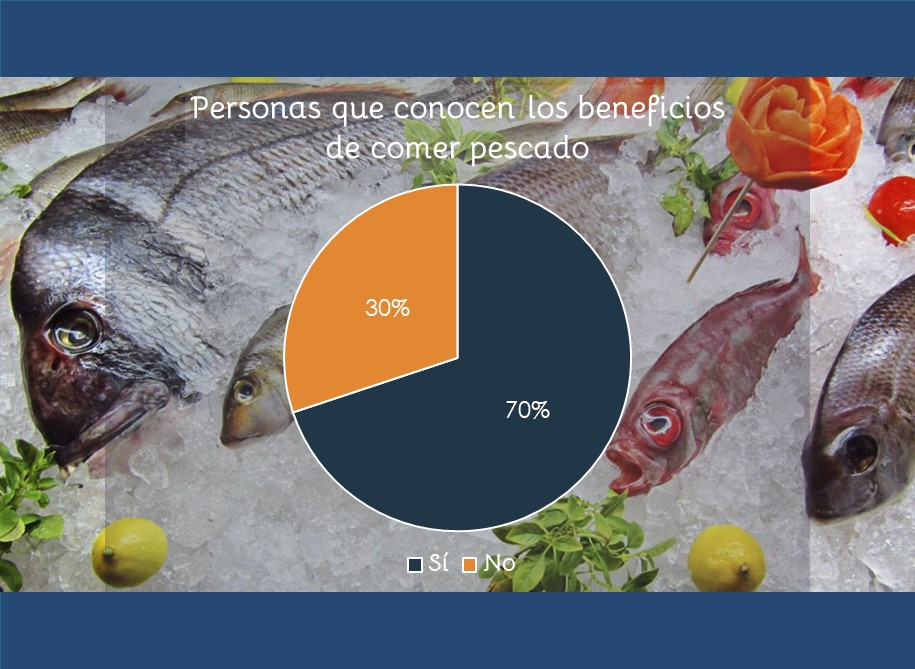

## COMER PESCADO TIENE LAS 3B
### Introducción
   El problema que abordaremos es el consumo de productos pesqueros en los jóvenes y adultos que tienen poder adquisitivo (grupo de edad de 15 a 43 años). 
   La forma en que éste se relaciona con la **ODS 12 (producción y consumo reponsable)** es que las personas **aprendan a consumir de forma responsable con su salud y con el ambiente**. 
   Como se sabe, en la población mexicana de 20 años o más, 42% de los hombres y 37% de las mujeres tienen sobrepeso (datos del INEGI del 2018), lo más alarmante de esto es que la tendencia va en aumento, lo cual es una evidencia de que no sabemos comer bien. Otro punto importante de la ODS 12 es la producción responsable y, aunque los consumidores no tenemos un papel directo en esta área sí podemos elegir qué consumimos. Es por eso que el proyecto también va enfocado a averiguar si las personas saben qué consumen y, al mismo tiempo, dar alternativas sustentables para el consumo de productos pesqueros.
 Los objetivos son los siguientes:
-	**Conocer** qué tan frecuente es el consumo de productos pesqueros, el tipo de producto se consume más (conserva, fresco o congelado) y el interés de la gente respecto a los beneficios del consumo de productos pesqueros.
-	Incentivar, mediante la **exposición de los beneficios**, el consumo de pescado.
-	Dar a conocer las medidas más **sostenibles** de consumo de pescado.
En este club 19 aprendimos sobre los _beneficios del consumo de pescado, moluscos y crustáceos y la **necesidad** de llevar una dieta balanceada_; queremos que este conocimiento no se quede aquí sino que se pueda **compartir para generar una cultura de comer bien**.
Este tema realmente es importante, puesto que muchos personas descuidan su alimentanción (y muchas veces la de su familia también) y no varían sus alimentos. Con la implementación de este proyecto no sólo queremos crear conciencia sobre la problemática en nuestro país sino que también queremos ayudar a mejorar la calidad de vida de los mexicanos.

### Métodología

Se realizó una encuesta a personas mexicanas, de 15 a 43 años. Las preguntas fueron las siguientes:
1.- ¿Con qué frecuencia consume pescado? (Respuestas: 1 vez a la semana/ vez cada 15 días/1 vez al mes/casi nunca/no consumo)
2.- En dado caso de que su consumo no sea tan frecuente, ¿cuáles son las razones por las que no lo hace?
3.- ¿En qué presentación come el pescado? Seleccione las que correspondan. (Respuestas: fresco/conserva(enlatado/salmuera)/congelado)
4.- ¿Conoce los beneficios de consumir pescado? (Respuestas:sí/no/no pero quisiera saber)
5.-¿Sabe de dónde provienen los alimentos pesqueros que consume? (Respuestas: sí/no/no y no me interesa)

Se hizo un análisis de datos con ayuda de Pandas en un google colab, los parámetros requeridos fueron:
- rango de edad de la encuesta, para ubicar a nuestros encuestados
- promedio de edad del grupo, para saber cómo se debe de promover el consumo (de forma más técnica o quizás más llamativa para jóvenes)
- promedio de frecuencia del consumo, con base a un mes
- número de consumidores habituales de productos pesqueros (quienes lo consumen al menos 1 vez al mes)
- las personas que conocen los beneficios del consumo de pescado
- número de consumidores que conocen los beneficios de su consumo
- número de consumidores habituales que consumen pescado fresco sólo o en adición con otras presentaciones de pescado
- personas que saben de dónde provienen los alimentos pesqueros que consumen (se hizo una división entre personas "normales" y los consumidores habituales)

### Resultados

Este es el momento en que nos compartas los resultados obtenidos en tu proyecto. Asegurate de incluir material visual (gráficas, fotos, diagramas, tablas).

Un dato de interés es conocer el rango de edad, planeado para jóvenes y adultos. Los resultados arrojan que las personas encuestadas son de 15 a 43 años. El promedio de edad es de 21 años, así que nos encontramos con un grupo bastante joven de personas; casi todas de nuestra edad.
El promedio de consumo es de 2 veces por mes (1.85), es decir, 1 vez cada 15 días. Lo cual no está tan mal según lo que aprendimos en el club, aunque sí se debe de fomentar, ya que lo ideal es comer 1 vez por semana.
De igual interés son las razones por las cuales no se consume, dichos datos se leyeron en forma personal y se analizaron en una discusión grupal; las razones se expondrán en el página web.
El número de personas que sí conoce los benficios de comer pescado es de: 79. Si se hace la resta, (113-79=34), 34 personas no conocen los beneficios de consumir productos pesqueros. Traducido a pocentaje es el 30% de encuestados que no conoce los beneficios.
Los consumidores habituales encontrados en una densidad de 113 encuestados es de 86 personas.
Dentro de los consumidores habituales se nos hizo de interés conocer cuántos
- conocen los beneficios
- consumen pescado fresco

Tomando el total de 86, vemos que
- 63 consumidores habituales conocen los beneficios (73.3%)
- 70 consumidores habituales consumen pescado fresco (81.4%)

Otro punto a analizar fue el conocimiento de la procedencia de los alimentos pesqueros. Este se hizo tanto con el público en general de la encuesta como con los consumidores habituales debido a que
- las personas debemos de saber de dónde provienen los alimentos, independientemente de si los consumimos o no, para poder orientar a nuestros familiares o amigos acerca de las  mejores opciones de consumo y poder llegar a hacer conciencia colectiva
- con los consumidores, es un tanto obvio, el poder elegir bien qué cosa compramos y qué tipo de comercio y producción estamos propiciando (aunque claro, la responsabilidad de que haya sobrepesca no recae en una sola persona o un sólo grupo, es algo mucho más complejo, pero podemos empezar por acá)
Los resultados fueron:
- Sólo 61 personas encuestadas conocen de dónde provienen los alimentos (53%)
- 46 consumidores habituales conocen la procedencia (53%)

Cuando estábamos dándole una ojeada a los resultados, nos sorprendió ver que habían contestado "no y no me interesa" en la parte de "procedencia", así que decidimos analizar la postura de esa persona (más que nada para saber cómo poder hacer que sí le interesara) y nos dimos cuenta de que su consumo es 0 (no consume) así que no nos alarmó tanto la respuesta, ya que es algo que puede intuirse.

En este colab se pueden ver los datos y las gráficas que programamos: https://colab.research.google.com/drive/1vKjs0Oa7DvlYdBv2cffxPsjThkvqqSei?usp=sharing 

Posterior al análisis de datos, se buscaron en la página de la WWF algunas recomendaciones para precisamente, tener un consumo responsable. Estas fueron las más importantes para nosotros: 
- Buscar los sellos de que certifican la sostenibilidad de los productos que consumos: MSC en pesca salvaje y ASC en acuicultura (Figura 2).
- Conocer más sobre los productos que se compran: dónde se pescan, cómo se capturan, qué flotas han emprendido acciones para asegurar su conservación…
- Evitar pescado o marisco de procedencia desconocida, ya que pueden haber sido capturados ilegalmente.
- Diversificar el consumo de pescados y mariscos, en cada estación del año cambia lo que el mar nos ofrece.
Así mismo, la WWF expone una guía de bolsillo del consumo responsable ¡no todo el pescado es sostenible! Y claro, dependiendo la zona en donde se esté ubicado, es 
el tipo de pescado que se recomienda consumir. Ahí se resume todo y es muy práctico, México se encuentra en la zona 77 y 31. En general, se recomienda consumir albacora (curricán) y esturión. No se recomiendan varias especies, sobre todo albacora (palangre de superficie), atún listado (cacea, cerco asociado a cardumen libre y cerco con FAD), atún patudo (cerco con FAD y palangre de superficie), langosta (nasas, nasas, a mano, enmalle y arrastre ).
(Los términos entre paréntesis se refiere a los métodos de pesca).

### Conclusiones
-En general, los datos encontrados son bastante “buenos”, la gente está medianamente informada de lo que consume y sus beneficios. Esta cifra de conocimiento aún no es lo suficientemente alta, ya que ronda apenas el 70% en consumidores frecuentes. Esta es la oportunidad de poder divulgar lo que vimos a lo largo del club 19.

-La mayoría de los consumidores habituales consumen pescado fresco, lo cual también es positivo, debido a que es el que mejor calidad de nutrientes tiene. Aunque los resultados son alentadores, aún hace falta bastante información, sobre todo en el área del conocimiento de “¿de dónde viene lo que comemos?”.

-Fue gratificante encontrar casi ninguna respuesta apática respecto a este punto.

-Un poco alarmante fue el hecho de encontrar varias especies que no deben consumirse según la guía de la WWF, es importante hacer algo al respecto para proteger los recursos marinos.

-Como hemos estudiado a lo largo de 3 semanas, el consumo de pescado, moluscos y crustáceos es muy favorable, incluirlo en nuestra dieta es una muy buena decisión.

El poder acercarnos a la opinión y vivencia de la gente amplía el panorama que ya teníamos sobre su consumo y nos da ciertas pautas para poder aplicar el conocimiento adquirido. Sin duda el proyecto no acaba acá y será tarea nuestra hacer conciencia sobre el consumo responsable de tan preciado recurso.

 
### Equipo

* Ángel Manuel Rodríguez Quintal
* Amelia López Albores
* Carla Margarita Barrera Cervantes
